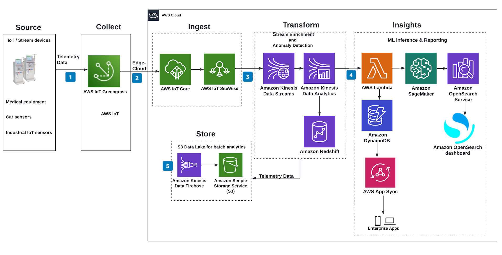

## Theory

1.  > What is the most efficient way for a Data Engineer to work with Data Scientists, Data Analysts and Software Engineers?

Firstly, a Data Engineer has to be able to discern and prioritize the workload because people generate new desires quicker than he can satisfy them, so understanding what is more important for the business at this moment can ensure that he takes care of more critical issues first. To make prioritization effective it is also important to communicate well with a cross-functional team, so use logic and persuasion to present his opinion and be able to support his arguments with facts and make sure that he communicates the deadlines, and deliveries on time to those who depend on his work. The project delivery is always uncertain as software engineering is prone to `unexpected behavior` and unforeseen bugs, therefore, a good Data Engineer ought to be able to quantify and estimate his deliveries, as well as to divide the work into smaller chunks, milestones to handle the project effectively and deliver the final product for other people on time. I think he is also supposed to possess an open mind to be able to communicate with people from different backgrounds and understand business language to impact and lead the projects that he is assigned to. Finally, his competencies and open mindedness can make a significant difference because he will be able to make an excellent solution for Analysts, Scientists, and other Engineers to interact with.

2.  > Which was the most game-changing learning you ever had working on massive data pipelines?

Most recently, I have worked for a U.S. cloud solutions company that had a massive project to migrate all existing data processing to AWS EMR, the company had over 500 pipelines from different departments that used Spark and they wanted to use EMR instead of old solutions. I was just starting at the company and saw the Head of Data and other subordinates negotiating this migration with external consultants. I saw that after 2 months of talking it wasn't getting anywhere due to NDA concerns and poorly held communications, so I met with the Head of Data and explained to her that they do not need extra resources, I can solely perform the transition within 6 months and require only a single Project Manager. They stopped the negotiations and I took over and completed the project on time, the solution was deemed excellent.

> Why was it so crucial under a technical and business point of view?

From a technical perspective, it was a very challenging task because I had to do major updates of the infrastructure (Airflow, Redshift), code (Java/Scala Spark apps, Python Backup services), architect a completely new system to use EMR Spark clusters effectively and share them across different teams (define cluster machine configs, optimize idle costs, use cheaper dynamic nodes) and integrate it fully into production. I would say that it was a lot to learn and troubleshoot, was exciting to solve the challenge. In terms of business, was interesting to estimate, break down project with PM, refactor code for other departments without breaking their functionality, optimize and negotiate cloud costs, and negotiate the delivery and project terms with management.

## Tech assignment

### 1. Design the infrastructure to support all steps of this “Machine Learning process”. This design document includes a list of stacks that need to be created, the technologies/services used, pros/cons, diagrams, …

To complete this assignment I have done some research to compile a general overview of the architecture that should be implemented for `machine learning process`; It will be divided into two separate steps: Data Processing Strategy and Machine Learning Pipelines. Such segregation is quite important due to the fact that not always big projects can keep the view of the entire machine learning process as data accumulation is very different from ML pipelines as it requires discerning and integrating new sources, whilst the other builds on already processed/structured data to generate decisions, insights.

### Data Processing Pipeline

Since mobile devices generate over 10TB of data daily, the stack has to incorporate a scalable queuing mechanic that would allow to avoid bottleneck issues at peak times as well as to ensure that no data is lost in the process.
Therefore, I have considered using a common data streaming pattern that lets mobile applications publish events to a specific raw topic in the queue (collect + ingest phases), process the streaming data into a structured format (transform), collect data for long-term analysis on scalable storage and database (store) and finally, push the results into analytical dashboards/machine learning pipelines.

Even though, the diagram shows the implementation of the stack specifically on AWS - there is no hard requirement to prefer AWS over GCP, Azure, or even a custom on-premise solution using Kafka. The architecture would be the same whilst the services that organize, and schedule the runs will vary depending on the implementation. But the required architectural entities are as follows:

- Application event Sinks (custom SDKs for cloud or Kafka producers for on-premise)
- Queue to store Raw events (Kinesis, PubSub, or Kafka)
- Stream processing apps (Beam flow, Kinesis Data Streams, Flink, Spark Streaming, ...)
- Long-term persistent storage for processed data (S3, cloud storage, and hdfs)
- Query database for analytics for processed data (BigTable, DynamoDB, Cassandra, Hive)
- BI-tools to observe analytical insights (Looker, Opensearch, Tableu, ...)

Again, this step offers only the processing of raw streaming data from the applications into a format that is easy to use and follow later on. The next chapter will focus on the mechanics to do machine learning using the data that has been obtained in this step.

#### Key considerations

##### Computing Speed

Modern ETL applications are built to serve specific business goals, thresholds vary depending on the use case. Two categories to consider - low latency processing and batch computing, where computation is performed on a set of files. The current problem does provide a sub-second processing requirement. The most time-consuming step is data processing, and I decided to build it using cloud-native applications that execute key transformations on top of JVM languages (Java, Scala) using Spark and Python to orchestrate the order of those transformations. This procedure for most cases is fast enough and provides built-in scalability and fault tolerance that is critical for streaming data orchestration. This ensures that data arrives on time and users will receive recommendations in real-time based on their preferences.

###### Normalized Data

Normalization can be seen as a process of reducing duplication and improving integration both logical and physical. It is often undervalued due to time constraints on the projects, it is indeed a challenging process to understand your data requiring a lot of due diligence: to correctly type and arrange data into different entities to not carry unneeded duplication around (e.g. decouple event data, from fact tables that do not change over time). In any case, the procedure is critical to improve the quality of the data which can make your service, product, or ML model stand out from the crowd, as well as improve the quality of interaction for your stakeholders, engineers, analysts, and customers. Moreover, the process of data normalization allows you to process more data as your understanding has improved and you can build on top of entity relationships, which would be messy and impossible to handle in a reliable way in production. The current project forces developers to integrate schema control and to structure the data as soon as it is received, there is no loose semi-structured approach because data validation at the early stages of the pipeline reduces the necessity to verify, and normalize data with the same level of rigor later on.

###### Developer Experience

The current project is fairly complex as it requires the developer to understand the meaning behind tables, and their relationship, and build code to process and distribute streaming data both to the database and long-term persistence S3 storage. Depending on the choice of technologies cloud solutions on AWS, GCP, and Azure can offer tools to seamlessly orchestrate the process in order to reduce complexity. One of the benefits of those tools (Cloud Watch, SNS, Formation, Lambda) is that your code base is significantly smaller as you can declare macros to process code inside the database and have more standardized processing across different tables, you do not have to build a separate service to support Scala applications or tune Redshift connectors for specific queue database dialect as code is generated from the provider's SDK. Focus of this design is to build a template and a high-level view of the architecture so that configuring Terraform for multiple providers can be easy, as well as to offer to build a codebase on top of the environment variables that would facilitate local and prod deployment (local testing launch would use a separate stack of resources that do not require a running S3, Redshift services). Moreover, it supports deployment modes (K8s, Docker, EC2) with hybrid/cloud modes, and it offers built-in tracing, CI/CD.

##### Scalability

One of the primary concerns was scaling as bad design can impact business operations, cause failed deliveries on SLAs, and bring down the system unexpectedly. In order to build a product that would be scalable - it is crucial to understand which steps of the pipeline may cause problems in the future, as well as which processes can benefit from automated scaling. For the latter, we can think of scaling as delegating responsibility to the service with built-in scaling (i.e. we provide more resources - as a means to address scaling in Spark/Flume); Global choice was to prefer JVM-based solutions (Beam, Flink, Kinesis Steams) (scales to petabyte processing) and Redshift, DynamoDB, S3 (own micro-partition method with elastic scaling) as target production services, both of them offer configurable setups that can be dynamically scaled to support existing workload level.

### Machine Learning Pipeline

After the data has been successfully collected, validated, and loaded to long-term storage - the next step would be to design a system to automate a sustainable MLOps pipeline that would offer feature engineering, model training, and evaluation. The nature of the underlying model that we use is not of high significance here, however, the system architecture is critical due to the fact that a proper ML pipeline should be able to:

- segregate code versions
- offer ML layer to train, build, and deploy models
- infrastructure for automated ML & testing DS practitioners
- facilitate provisioning using IaC
- retrain models
- monitor live model performance

In terms of the technologies used, I will follow the same approach I have used previously and state that if you choose cloud solutions you have a variety of externally managed services that are built with quick integration/deployment in mind, while custom on-premise solutions would require a more thorough analysis of the business and resources in order to determine the products that would bring the most value to the current problem at hand. The example diagram show an implementation of a machine learning process on AWS, however, the approach for other platforms or on-premise solution is no different; I will cover the main steps with possible technology choice:

#### SageMaker's notebook with custom VPC (1)

Simply put it is an ML environment EC2 instance that has a pre-configured set of dependencies (e.g. PyTorch, xgb, R, Python) and will be used behind secured gates (firewall, NAT resolution). The benefit of this step is to set up an environment with the version, and resources that fit our liking using Terraform, Ansible, or Puppet.

The next step after initializing resources would be to run code, however, notebooks cannot run production code directly, so we have to wrap the code into a model within a Docker container and launch it on a production/test stand. To achieve it, mostly Git pipelines are used (Bitbucket, AWS CodeCommit, ...) - they package your new changes from a specified repository branch into an isolated container that can be executed later on. As seen from the diagram, Sagemaker's notebook has two arrows one for exploratory container CI/CD pipelines, while the other one is for production deployment with model training pipeline (2).

#### CI/CD pipelines

##### Exploratory pipeline (3)

Before creating a production model scientists and engineers have to thoroughly test their code to not break production services. Sometimes, development requires testing new code/model in the production environment (e.g. using blue-collar deployment), therefore, we have to establish an automated deployment branch (3 from the diagram) that would push a custom model container to the production train/deploy pipeline to evaluate the performance of the model later on. This also helps to mitigate the risk of pushing too much breaking code into the core pipeline as there is a preliminary step of validation that requires containers to resolve the environment, and compile and run predefined tests for the branch.

##### Core ML pipeline (2)

The main part of the ML pipeline is where the model is trained and deployed before being deployed to production. The diagram also incorporates the data validation step with Lambda, but more generally, we can use pure Airflow to check if the required data resources are up-to-date, and dependencies are met on some custom conditions checks. In terms of the orchestration there are multiple options - Jenkins, Spinnaker, AWS pipeline-as-code, or even custom solutions such as H20 as they offer a fine-grained level of control over different models deployed simultaneously and allow to re-execute certain steps upon failure as well as to fully automate the process of creating the production ML model.

#### Live model monitoring (4)

For each ML process, there is a hard requirement to establish a live check that would ensure that our model delivers both relevant insights and there is no delay in the delivery, therefore, the next step after deployment is to automate the performance evaluation of a running model. Kubeflow, MLflow, Sagemaker, Neptune.ai, and many others offer code and infra to evaluate live predictions of the model, CI/CD pipelines, and even underlying machine state metrics. This step ensures that a newly deployed model meets certain criteria, e.g. achieves a level of ROI or number of clicks we expect from a recommendation ad engine.

#### Model re-training (5)

Based on the previous step, if our model has failed to meet a certain threshold we can launch an automated re-training using scheduled (e.g. weekly cron job), metric-based (failed to achieve ROI due to model drift), or finally, based on event-related to newly arrival of the data (retrain the model with new products/user demographics). Those triggers are essential and on the diagram use the AWS infrastructure to trigger three types of re-training jobs upon the check of either EventBridge or CloudWatch.

### 2. Prioritize the work in a high-level roadmap, with timing, dependencies, …

Timings are out of the question as there is not enough data regarding given resources (time, money, employees, their competence), and in order to make a prognostic arrangement I have to understand what is the productivity baseline of a certain cross-functional team. Moreover, any prioritization works as a loop cycle where feedback from a less sophisticated system is used as a means of optimization for later parts of project revision.

High level roadmap on the other hand is fairly simple:

$$
storage > computing > resource\ orchestration > ML\ platform > DevOps\ tools
$$

#### Storage

Storage refers to infrastructure that supports saving data for long-term persistence: HDFS, S3; for queue-based events: Kafka, Kinesis, PubSub; for querying and accessing in a more structured format: Redshift, DynamoDB, Snowflake. It is essential to have storage configured before launching any project as it allows for consolidation and writing of the data to be used for the steps downstream. As an outcome, I would expect a range of IaC scripts (Terraform) to launch resources optimally for a given data flow traffic.

##### ETA

Depending on the project, data, and team if 10TB of data units and the company has resources to use Cloud infrastructure (AWS, GCP) - then time has to be calculated by the infrastructure team based on their availability/project urgency. An average pessimistic estimate would be around 1-3 months.

##### Dependencies

###### Teams

- Data expert with good communication/analytical skills to efficiently translate data traffic flow into storage requirements and communicate it to the DevOps team clearly to configure sufficient resources for testing/POC job
- DevOps team to set both testing infrastructure and production one; As well as available to address ad-hoc requests to adjust the solution accordingly during the process

###### Resources

- Costs, outstanding budget for both testing and a monthly subscription to use the service
- Infrastructure adjustments, sometimes organizations keep part of the computation on-premise (KMS systems, sensitive data, etc.)

#### Computing

Computing refers to infrastructure that supports data-processing and it will vary for DE & ML processes. DE processes use infrastructure for streaming/batch-processing of the data that is optimized for long-term automation of data handling, while ML infrastructure uses platforms to test hypotheses, train models, and generate features. As an outcome of these features, I would expect:

##### DE

- IaC scripts to deploy computing infrastructure (EMR, Flume on K8s, ...)
- Logging infrastructure (ELK, Grafana, Prometheus) to track, and monitor the state of the services
- Configurations to load balance of different granularity based on load or dynamic resolvers for traffic levels
- Working role-based environment for read/write granular access to resources for development, production use

###### ETA

Depends on the project, data, and team if 10TB of data units and the company has resources to use Cloud infrastructure (AWS, GCP) - then the time has to be calculated by the infrastructure team based on their availability/project urgency. An average pessimistic estimate would be around 2-3 months.

##### ML

- IaC scripts to deploy infrastructure (Kubeflow, MLFlow, SageMaker)
- Working environments with read access to data sources to train, test, and deploy models (S3, Redshift)
- Custom configuration templates for ML problems relevant to domains to re-use recommendation engine tools

###### ETA

Depends on the project, data, and team if 10TB of data units and the company has resources to use Cloud infrastructure (AWS, GCP) - then the time has to be calculated by the infrastructure team based on their availability/project urgency. An average pessimistic estimate would be around 3-5 months.

##### Dependencies

###### Previous Steps

- Storage to access raw, processed data
- DevOps (storage) to speed up deployment of resources

###### Teams

- Data expert with good communication/analytical skills to efficiently translate data processing into computing infrastructure requirements
- ML expert with good communication/analytical skills to efficiently translate data processing into computing infrastructure requirements
- DevOps team to set both testing infrastructure and production one; As well as available to address ad-hoc requests to adjust the solution accordingly during the process

###### Resources

- Costs, outstanding budget for both testing and a monthly subscription to use the service
- Infrastructure adjustments, sometimes organizations keep part of the computation on-premise (KMS systems, sensitive data, etc.)

#### Resource Orchestration

Refers to infrastructure that supports data management across stages and organizes rule-based transformations on the data in the pipeline. The software connects computing and storage resources to create a data processing system with a specific goal in mind (Airflow, Dagster, Kubeflow). As an outcome, I would expect:

##### DE

- event-processing system (Airflow, Dagster, Prefect, Luigi)
- templated pipelines (common DSL, shared code to reduce re-inventing the wheel)
- validation system (Confluent Schema Registry, greaterexpectations)
- notification system (Data corruption, inconsistencies, arrivals)
- DWH design strategy (Proper environment separation, no data duplication)
- database design standard strategy (Star schema, data normalization)
- resource management system (shared access to computing clusters for testing)

##### ETA

Depends on the project, data, and team if 10TB of data units and the company has resources to use Cloud infrastructure (AWS, GCP) - then the time has to be calculated by the infrastructure team based on their availability/project urgency. An average pessimistic estimate would be around 16-32 months for a big project.

##### ML

- model training/re-training pipeline with model stores, feature stores
- deployment pipeline to wrap the model and promote it to production
- live model performance evaluating system to adjust feedback and re-train models
- a model re-training system based on an event (data arrival), schedule (weekly), and live metrics (low production model fit)

##### ETA

Depends on the project, data, and team if 10TB of data units and the company has resources to use Cloud infrastructure (AWS, GCP) - then the time has to be calculated by the infrastructure team based on their availability/project urgency. An average pessimistic estimate would be around 14-24 months for a big project.

##### Dependencies

###### Previous Steps

- Storage layer to access raw, processed data
- Compute infrastructure layer to run DE/DS jobs
- DevOps (storage, compute) to speed up deployment of resources

###### Teams

- Lead DE/DS who can track progress, prioritize, and distribute workflow efficiently
- Team of experts with possible sub-leads to deliver fine-grained features to enable another developer to save time
- Project Manager to manage the timeline, and deliveries, and keep the feedback loop between higher management
- DevOps team to set up some additional infrastructure, and address ad-hoc requests
- DS/DE team to deliver critical data insights on how data should be stored to make their models better

###### Resources

- Costs, outstanding budget for both testing and a monthly subscription to use the service
- Infrastructure, sometimes organizations keep part of the computation on-premise (KMS systems, sensitive data, etc.)

#### DevOps tools

This section is omitted since each previous stage can be continuously improved with DevOps practices and separating each small section such as the feature store, or data validation system into a project estimate would not be very informative for the given task. Therefore, I will mention that DevOps can be used at every required step of the pipeline to improve the process by reducing manual workload for the developers, and it should not be a separate project to integrate such practices, but rather a de-facto project standard to deliver an IaC solution as an outcome for any software related endeavor.

## References

- https://aws.amazon.com/blogs/architecture/building-event-driven-architectures-with-iot-sensor-data/
- https://aws.amazon.com/blogs/apn/taming-machine-learning-on-aws-with-mlops-a-reference-architecture/

